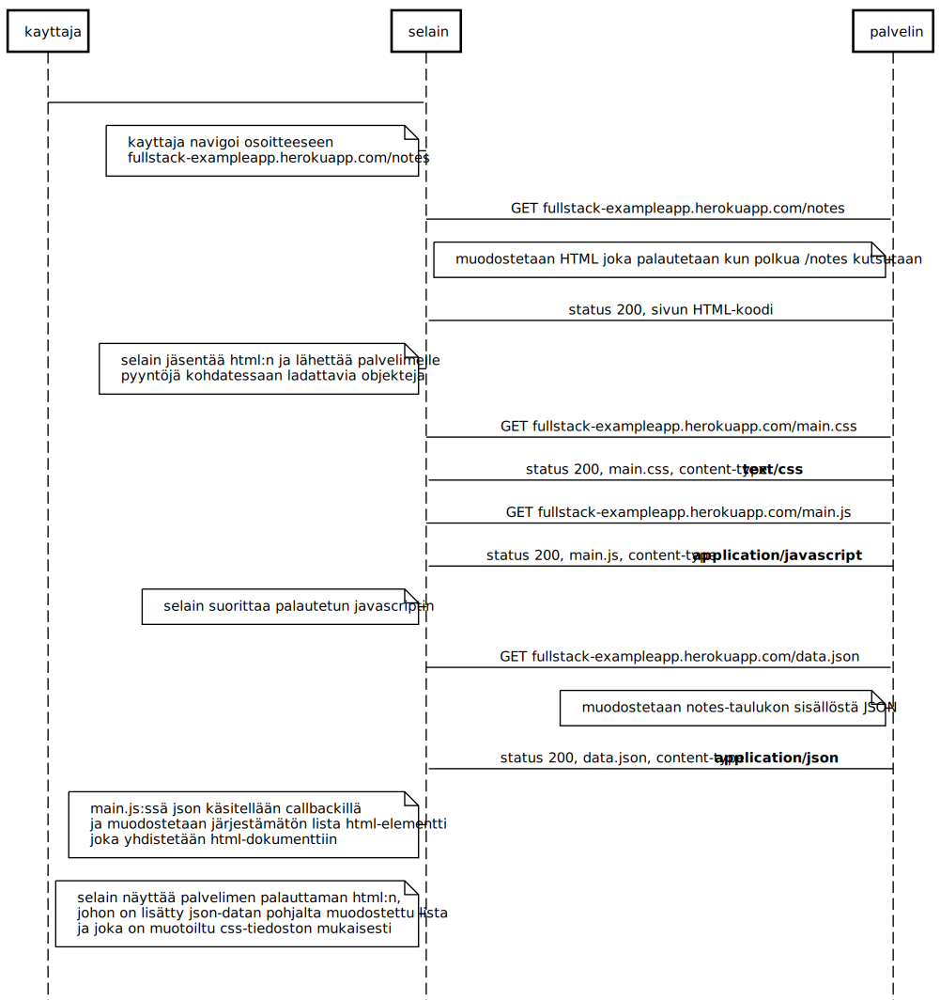
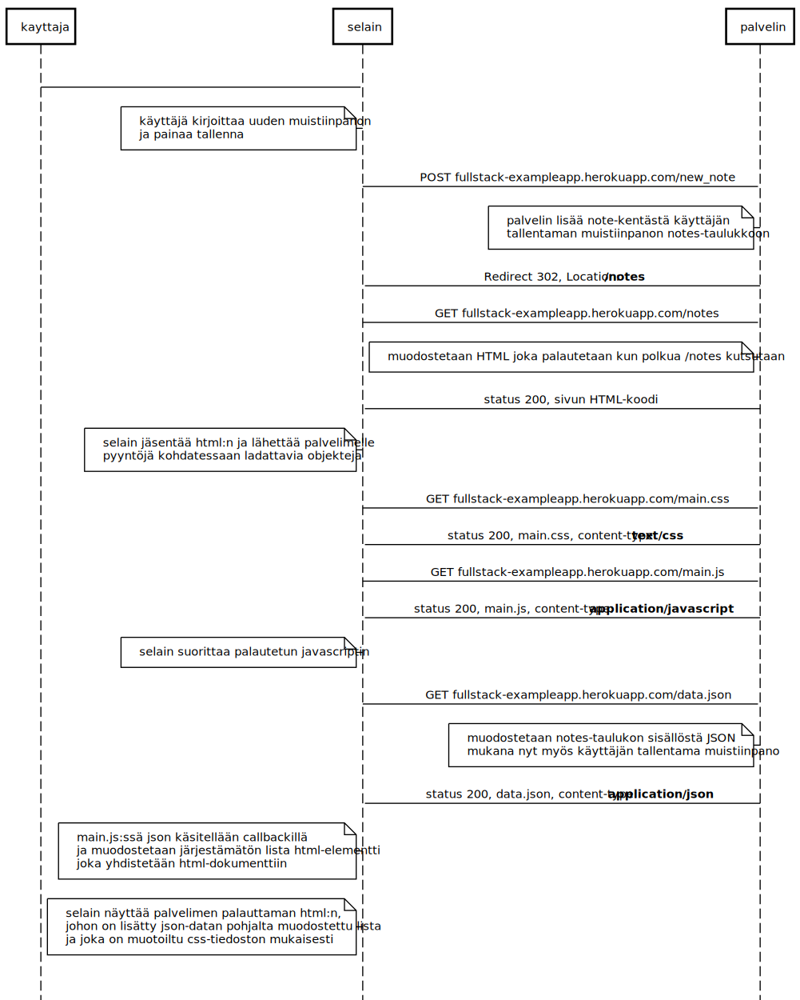

## Harjoitus 0.3 - muistiinpanojen sivu



**sequencediagram.org syntax:**

```kayttaja->selain: note left of selain:kayttaja navigoi osoitteeseen\n fullstack-exampleapp.herokuapp.com/notes
selain->palvelin: GET fullstack-exampleapp.herokuapp.com/notes
note left of palvelin: muodostetaan HTML joka palautetaan kun polkua /notes kutsutaan

palvelin->selain: status 200, sivun HTML-koodi

note left of selain: selain jäsentää html:n ja lähettää palvelimelle\npyyntöjä kohdatessaan ladattavia objekteja

selain->palvelin: GET fullstack-exampleapp.herokuapp.com/main.css
palvelin->selain: status 200, main.css, content-type: **text/css**

selain->palvelin: GET fullstack-exampleapp.herokuapp.com/main.js
palvelin->selain: status 200, main.js, content-type: **application/javascript**

note left of selain: selain suorittaa palautetun javascriptin

selain->palvelin: GET fullstack-exampleapp.herokuapp.com/data.json
palvelin->selain:status 200, data.json, content-type:**application/json**

note left of selain: main.js:ssä json käsitellään callbackillä\nja muodostetaan järjestämätön lista html-elementti\njoka yhdistetään html-dokumenttiin

note left of selain: selain näyttää palvelimen palauttaman html:n,\njohon on lisätty json-datan pohjalta muodostettu lista\nja joka on muotoiltu css-tiedoston mukaisesti
```


## Harjoitus 0.4 - Uusi muistiinpano




**sequencediagram.org syntax:**

```
kayttaja->selain:
note left of selain:käyttäjä kirjoittaa uuden muistiinpanon\nja painaa tallenna

selain->palvelin:POST fullstack-exampleapp.herokuapp.com/new_note
note left of palvelin:palvelin lisää note-kentästä käyttäjän\ntallentaman muistiinpanon notes-taulukkoon
palvelin->selain:Redirect 302, Location:**/notes**

selain->palvelin: GET fullstack-exampleapp.herokuapp.com/notes
note left of palvelin: muodostetaan HTML joka palautetaan kun polkua /notes kutsutaan

palvelin->selain: status 200, sivun HTML-koodi

note left of selain: selain jäsentää html:n ja lähettää palvelimelle\npyyntöjä kohdatessaan ladattavia objekteja

selain->palvelin: GET fullstack-exampleapp.herokuapp.com/main.css
palvelin->selain: status 200, main.css, content-type: **text/css**

selain->palvelin: GET fullstack-exampleapp.herokuapp.com/main.js
palvelin->selain: status 200, main.js, content-type: **application/javascript**

note left of selain: selain suorittaa palautetun javascriptin

selain->palvelin: GET fullstack-exampleapp.herokuapp.com/data.json
note left of palvelin:muodostetaan notes-taulukon sisällöstä JSON\nmukana nyt myös käyttäjän tallentama muistiinpano
palvelin->selain:status 200, data.json, content-type:**application/json**

note left of selain: main.js:ssä json käsitellään callbackillä\nja muodostetaan järjestämätön lista html-elementti\njoka yhdistetään html-dokumenttiin

note left of selain: selain näyttää palvelimen palauttaman html:n,\njohon on lisätty json-datan pohjalta muodostettu lista\nja joka on muotoiltu css-tiedoston mukaisesti
```


## Harjoitus 0.5 - Single page app


**sequencediagram.org syntax:**

```kayttaja->selain:
note left of selain:kayttaja navigoi osoitteeseen\nfullstack-exampleapp.herokuapp.com/spa

selain->palvelin: GET fullstack-exampleapp.herokuapp.com/spa
note left of palvelin: muodostetaan HTML joka palautetaan kun polkua /spa kutsutaan

palvelin->selain: status 200,content-type: **text/html**, sivun HTML-koodi

note left of selain: selain jäsentää html:n ja lähettää palvelimelle\npyyntöjä kohdatessaan ladattavia objekteja

selain->palvelin: GET fullstack-exampleapp.herokuapp.com/main.css
palvelin->selain: status 200, main.css, content-type: **text/css**

selain->palvelin: GET fullstack-exampleapp.herokuapp.com/spa.js
palvelin->selain: status 200, main.js, content-type: **application/javascript**

note left of selain: selain suorittaa palautetun javascriptin, lähettää GET-pyynnön data.json

selain->palvelin: GET fullstack-exampleapp.herokuapp.com/data.json
note left of palvelin:muodostetaan notes-taulukon sisällöstä JSON
palvelin->selain:status 200, data.json, content-type:**application/json**

note left of selain: spa.js:ssä json käsitellään callbackillä\nja muodostetaan järjestämätön lista html-elementti\njoka yhdistetään html-dokumenttiin

note left of selain: selain näyttää palvelimen palauttaman html:n,\njohon on lisätty json-datan pohjalta muodostettu lista\nja joka on muotoiltu css-tiedoston mukaisesti
```


## Harjoitus 0.6 - Uusi muistiinpano SPA:ssa


**sequencediagram.org syntax:**

```
kayttaja->selain:
note left of selain:käyttäjä kirjoittaa uuden muistiinpanon\nja painaa tallenna
selain->selain:selaimessa javascript estää oletusarvoisen lomakkeen lähetyksen,\nlisää muistiinpanon taulukkoon, piirtää selainnäkymän järjestämättömän listan uudelleen

selain->palvelin:POST /new_note_spa, Content-type: application/json

note left of palvelin: palvelin tallentaa muistiinpanon taulukkoon

palvelin->selain:Success, 201 created

note left of selain:console.log palvelimen vastaus

```

